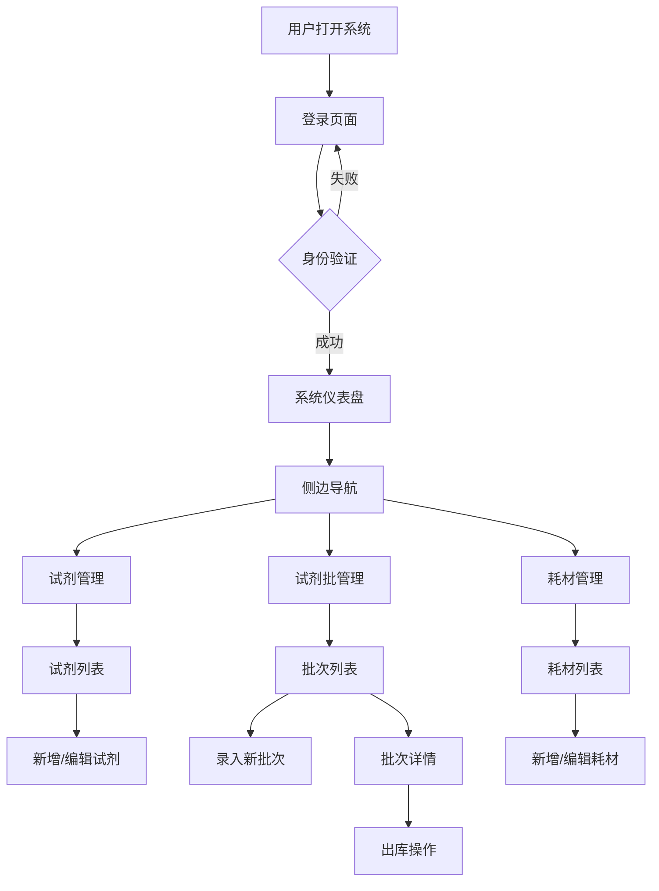

## 1. 产品概述

面向生物实验室的试剂与耗材管理系统，旨在解决实验室试剂批次追踪、库存管理、效期预警等核心痛点，提升实验室运营效率与合规性。

- 主要用途：试剂全生命周期管理、耗材库存监控、批次溯源、效期管理
- 目标用户：实验室管理员、实验人员、质量控制人员
- 产品价值：减少试剂浪费、避免使用过期试剂、提高库存周转率、满足审计追溯要求

## 2. 核心功能

### 2.1 用户角色

| 角色 | 注册方式 | 核心权限 |
|------|----------|----------|
| 系统管理员 | 系统预置 | 用户管理、系统配置、所有数据权限 |
| 实验室管理员 | 管理员创建 | 试剂/耗材管理、批次管理、库存查看、审批流程 |
| 普通实验员 | 管理员创建 | 试剂/耗材查询、领用申请、使用记录登记 |

### 2.2 功能模块

1. **登录页面**：用户认证、密码校验、登录状态保持
2. **仪表盘**：数据概览、库存预警、效期提醒、统计图表
3. **试剂管理**：试剂信息CRUD、分类管理、规格配置
4. **试剂批管理**：批次录入、批次追踪、效期管理、入库出库记录
5. **耗材管理**：耗材信息CRUD、库存管理、领用记录

### 2.3 页面详情

| 页面名称 | 模块名称 | 功能描述 |
|----------|----------|----------|
| 登录页面 | 登录表单 | 用户名密码输入、登录验证、错误提示 |
| 登录页面 | 品牌展示 | 系统Logo、系统名称、实验室文化背景图 |
| 仪表盘 | 数据概览卡 | 试剂总数、耗材总数、近效期数量、库存预警数量 |
| 仪表盘 | 效期预警列表 | 按到期时间排序展示即将过期的试剂批次 |
| 仪表盘 | 库存趋势图 | 近30天出入库趋势折线图 |
| 仪表盘 | 分类统计 | 试剂/耗材分类占比饼图 |
| 试剂管理 | 试剂列表 | 分页列表、搜索筛选、分类过滤 |
| 试剂管理 | 试剂表单 | 新增/编辑试剂信息（名称、CAS号、分类、规格、单位等） |
| 试剂批管理 | 批次列表 | 按试剂筛选批次、状态标签、效期高亮 |
| 试剂批管理 | 批次录入 | 批次号、生产日期、有效期、入库数量、存储位置 |
| 试剂批管理 | 批次详情 | 批次基本信息、出入库记录时间线、剩余库存 |
| 试剂批管理 | 出库操作 | 领用人、领用数量、用途备注 |
| 耗材管理 | 耗材列表 | 分页展示、库存状态、低库存预警 |
| 耗材管理 | 耗材表单 | 新增/编辑耗材信息 |
| 主布局 | 侧边导航 | 菜单导航、用户头像、退出登录 |
| 主布局 | 顶部栏 | 面包屑、全局搜索、消息通知 |

## 3. 核心流程

用户登录系统后，可根据角色权限访问相应功能模块。实验室管理员可进行试剂和耗材的全流程管理，包括试剂信息录入、批次管理、库存监控等；普通实验员可查询库存并提交领用申请。

## 4. 用户界面设计

### 4.1 设计风格

- **主色调**：科研蓝渐变（#1E88E5 → #1565C0），体现专业、严谨、可信赖的科研氛围
- **辅助色**：
  - 成功绿：#43A047（库存充足、正常状态）
  - 警告橙：#FB8C00（低库存、即将过期）
  - 危险红：#E53935（已过期、库存不足）
  - 中性灰：#546E7A（次要信息）
- **背景色**：
  - 主背景：#F5F7FA（柔和浅灰，减少视觉疲劳）
  - 卡片背景：#FFFFFF（白色，增强对比度）
- **按钮风格**：圆角8px，主按钮蓝色渐变填充，次要按钮白色描边
- **字体**：
  - 标题："Noto Sans SC"，字号16-24px，字重600-700
  - 正文："Noto Sans SC"，字号13-14px，字重400
  - 数字/编号："JetBrains Mono"，等宽字体，便于数据对比
- **布局风格**：左侧固定导航栏 + 顶部面包屑栏 + 主内容区，卡片式内容布局
- **图标风格**：Ant Design Vue 线性图标，简洁专业

### 4.2 页面设计概览

| 页面名称 | 模块名称 | UI元素 |
|----------|----------|----------|
| 登录页面 | 整体布局 | 左右分栏：左侧品牌区（深蓝渐变+实验室场景插画/装饰），右侧登录表单区（白色卡片） |
| 登录页面 | 登录表单 | 圆角输入框带图标、蓝色渐变登录按钮、悬浮微动画、错误抖动效果 |
| 仪表盘 | 数据卡片 | 4个统计卡片横向排列，渐变背景色，图标+数字+环比变化，悬浮抬升效果 |
| 仪表盘 | 效期预警表 | 表格行按紧急程度标色（橙/红），倒数天数标签，状态徽章 |
| 仪表盘 | 图表区 | 左右双栏布局，左侧折线图（趋势），右侧饼图（分类） |
| 试剂管理 | 列表页 | 顶部搜索筛选栏（关键词+分类下拉+状态筛选+新增按钮），表格支持行悬浮高亮，操作列按钮 |
| 试剂批管理 | 批次列表 | 试剂切换标签栏，批次卡片/表格混排，效期进度条，状态彩色徽章 |
| 试剂批管理 | 批次详情 | 顶部基本信息卡片，中间库存进度条，下方时间线式出入库记录 |
| 耗材管理 | 列表页 | 库存进度条列，低库存行红色标记，库存数量彩色标识 |
| 主布局 | 侧边栏 | 深蓝背景，白色图标文字，选中项蓝色高亮+左侧指示条，可折叠 |
| 主布局 | 顶部栏 | 面包屑导航，搜索框，通知铃铛带红点，用户头像下拉菜单 |

### 4.3 响应式设计

- 设计策略：桌面端优先，适配平板
- 桌面端（≥1200px）：侧边栏展开240px，主内容区自适应
- 平板端（768-1199px）：侧边栏折叠为64px图标模式
- 登录页：左右分栏在小屏幕切换为上下堆叠
- 表格：横向滚动，保持列可读性

### 4.4 动效与交互

- 页面切换：淡入过渡（300ms）
- 卡片悬浮：向上抬升4px + 阴影增强（200ms）
- 按钮点击：缩放0.98回弹效果
- 数据加载：骨架屏占位 + 淡入显示
- 侧边栏折叠：平滑宽度过渡（300ms）
- 徽章状态：新增批次时滑入动画
