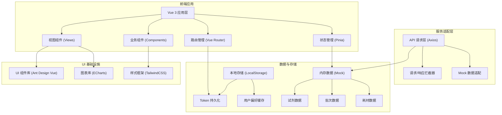
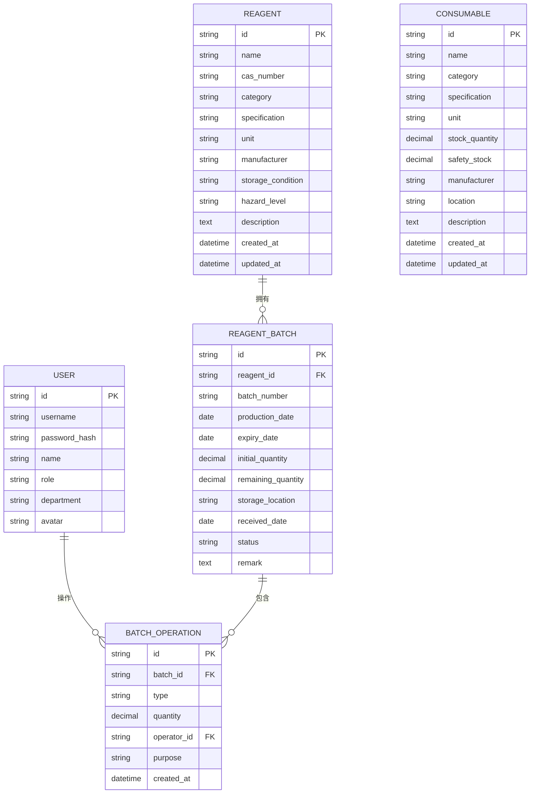

## 1. 架构设计



## 2. 技术描述

- **前端框架**：Vue@3.4 + TypeScript@5 + Vite@5
- **初始化工具**：Vite create-vue 脚手架
- **UI 组件库**：Ant Design Vue@4 (企业级组件，契合管理系统场景)
- **状态管理**：Pinia@2 (Vue 3 官方推荐)
- **路由管理**：Vue Router@4
- **HTTP 客户端**：Axios@1 (含请求拦截器、响应统一处理)
- **图表可视化**：ECharts@5 (Apache 出品，功能强大)
- **样式方案**：TailwindCSS@3 + SCSS (原子化 CSS + 自定义样式)
- **图标**：@ant-design/icons-vue
- **后端**：无，使用前端 Mock 数据模拟
- **数据持久化**：LocalStorage 存储登录状态与用户偏好
- **代码规范**：ESLint + Prettier

## 3. 路由定义

| 路由路径 | 页面名称 | 权限要求 | 说明 |
|----------|----------|----------|------|
| /login | 登录页 | 公开 | 用户认证入口 |
| / | 仪表盘 | 登录后 | 数据概览、预警、统计图表 |
| /reagents | 试剂管理 | 登录后 | 试剂信息列表、新增、编辑、删除 |
| /reagents/:id/batches | 试剂批管理 | 登录后 | 指定试剂的批次列表、录入、出库 |
| /batches | 批次总览 | 登录后 | 所有试剂批次的全局视图 |
| /consumables | 耗材管理 | 登录后 | 耗材信息列表、新增、编辑、删除 |
| /profile | 个人中心 | 登录后 | 用户信息、修改密码 |
| * | 404 页面 | 公开 | 路由未匹配兜底 |

## 4. API 定义 (Mock)

### 4.1 类型定义

```typescript
// 用户相关
interface User {
  id: string;
  username: string;
  name: string;
  role: 'admin' | 'lab_manager' | 'lab_staff';
  avatar?: string;
  department: string;
}

interface LoginRequest {
  username: string;
  password: string;
}

interface LoginResponse {
  token: string;
  user: User;
}

// 试剂相关
interface Reagent {
  id: string;
  name: string;
  casNumber?: string;
  category: string;
  specification: string;
  unit: string;
  manufacturer?: string;
  storageCondition: string;
  description?: string;
  hazardLevel?: 'low' | 'medium' | 'high';
  createdAt: string;
  updatedAt: string;
}

// 试剂批次相关
interface ReagentBatch {
  id: string;
  reagentId: string;
  batchNumber: string;
  productionDate: string;
  expiryDate: string;
  initialQuantity: number;
  remainingQuantity: number;
  storageLocation: string;
  receivedDate: string;
  status: 'normal' | 'warning' | 'expired' | 'exhausted';
  remark?: string;
}

interface BatchOperation {
  id: string;
  batchId: string;
  type: 'in' | 'out';
  quantity: number;
  operator: string;
  operatorName: string;
  purpose?: string;
  createdAt: string;
}

// 耗材相关
interface Consumable {
  id: string;
  name: string;
  category: string;
  specification: string;
  unit: string;
  stockQuantity: number;
  safetyStock: number;
  manufacturer?: string;
  location?: string;
  description?: string;
  createdAt: string;
  updatedAt: string;
}

// 通用响应
interface ApiResponse<T> {
  code: number;
  message: string;
  data: T;
}

interface PageResult<T> {
  list: T[];
  total: number;
  page: number;
  pageSize: number;
}
```

### 4.2 Mock 接口清单

| 方法 | 路径 | 说明 | 请求体 | 响应体 |
|------|------|------|--------|--------|
| POST | /api/auth/login | 用户登录 | LoginRequest | LoginResponse |
| POST | /api/auth/logout | 用户登出 | - | void |
| GET | /api/user/profile | 获取当前用户 | - | User |
| GET | /api/reagents | 试剂分页列表 | query: {page, pageSize, keyword, category} | PageResult\<Reagent\> |
| GET | /api/reagents/:id | 试剂详情 | - | Reagent |
| POST | /api/reagents | 新增试剂 | Reagent (无id) | Reagent |
| PUT | /api/reagents/:id | 更新试剂 | Reagent | Reagent |
| DELETE | /api/reagents/:id | 删除试剂 | - | void |
| GET | /api/reagents/categories | 试剂分类列表 | - | string[] |
| GET | /api/batches | 批次列表 | query: {page, pageSize, reagentId, status} | PageResult\<ReagentBatch\> |
| GET | /api/batches/:id | 批次详情 | - | ReagentBatch & {operations: BatchOperation[]} |
| POST | /api/batches | 录入新批次 | ReagentBatch (无id) | ReagentBatch |
| POST | /api/batches/:id/out | 批次出库 | {quantity, operator, purpose} | BatchOperation |
| GET | /api/consumables | 耗材分页列表 | query: {page, pageSize, keyword, category} | PageResult\<Consumable\> |
| GET | /api/consumables/:id | 耗材详情 | - | Consumable |
| POST | /api/consumables | 新增耗材 | Consumable (无id) | Consumable |
| PUT | /api/consumables/:id | 更新耗材 | Consumable | Consumable |
| DELETE | /api/consumables/:id | 删除耗材 | - | void |
| GET | /api/dashboard/stats | 仪表盘统计 | - | {reagentCount, consumableCount, expiringCount, lowStockCount, categoryStats[], trendData[]} |

## 5. 数据模型 (ER)



## 6. 项目目录结构

```
hjj-1/
├── public/                    # 静态资源
│   └── favicon.ico
├── src/
│   ├── assets/                # 资源文件
│   │   ├── images/
│   │   └── styles/
│   │       └── global.scss
│   ├── components/            # 通用业务组件
│   │   ├── PageContainer.vue
│   │   ├── StatCard.vue
│   │   ├── StatusBadge.vue
│   │   └── SearchBar.vue
│   ├── layouts/               # 布局组件
│   │   ├── MainLayout.vue
│   │   ├── components/
│   │   │   ├── Sidebar.vue
│   │   │   └── Header.vue
│   │   └── BlankLayout.vue
│   ├── mock/                  # Mock 数据与接口
│   │   ├── index.ts
│   │   ├── auth.ts
│   │   ├── reagents.ts
│   │   ├── batches.ts
│   │   ├── consumables.ts
│   │   └── dashboard.ts
│   ├── router/                # 路由配置
│   │   └── index.ts
│   ├── stores/                # Pinia 状态管理
│   │   ├── user.ts
│   │   └── app.ts
│   ├── api/                   # API 接口封装
│   │   ├── request.ts         # Axios 实例
│   │   ├── auth.ts
│   │   ├── reagents.ts
│   │   ├── batches.ts
│   │   ├── consumables.ts
│   │   └── dashboard.ts
│   ├── types/                 # TypeScript 类型定义
│   │   ├── user.ts
│   │   ├── reagent.ts
│   │   ├── batch.ts
│   │   ├── consumable.ts
│   │   ├── common.ts
│   │   └── api.ts
│   ├── utils/                 # 工具函数
│   │   ├── storage.ts
│   │   ├── date.ts
│   │   └── status.ts
│   ├── views/                 # 页面视图
│   │   ├── login/
│   │   │   └── index.vue
│   │   ├── dashboard/
│   │   │   └── index.vue
│   │   ├── reagents/
│   │   │   ├── index.vue
│   │   │   └── components/
│   │   │       ├── ReagentForm.vue
│   │   │       └── BatchList.vue
│   │   ├── batches/
│   │   │   ├── index.vue
│   │   │   └── components/
│   │   │       ├── BatchForm.vue
│   │   │       ├── BatchDetail.vue
│   │   │       └── OutboundForm.vue
│   │   ├── consumables/
│   │   │   ├── index.vue
│   │   │   └── components/
│   │   │       └── ConsumableForm.vue
│   │   └── profile/
│   │       └── index.vue
│   ├── App.vue
│   └── main.ts
├── .eslintrc.cjs
├── .prettierrc
├── tsconfig.json
├── vite.config.ts
├── tailwind.config.js
├── postcss.config.js
└── package.json
```
